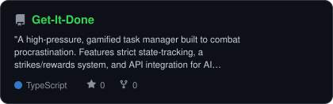
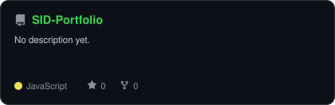
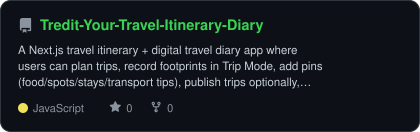
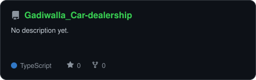

<div align="center">

<!-- PORTRAIT - generated by scripts/dotify.py -->


<br>

<!-- NAME / TAGLINE - animated typing -->
<a href="https://github.com/sudhanshu-SID">
  
</a>

<br>

<!-- SOCIALS -->
<a href="https://www.linkedin.com/in/ranjan-sudhanshu/"></a>
<a href="mailto:sudhanshu7536@gmail.com"></a>
<a href="https://www.sidcreates.com/"></a>
<a href="https://takeuforward.org/profile/lets_start_coding"></a>
<a href="https://x.com/confused_atma"></a>


</div>

---

## `~/` whoami

```console
- A wanna be creator
```

Hi, I'm **Sudhanshu**. I build things that sit somewhere between machine learning and the web,
and I solve problems for fun when neither of those is cooperating.

- Currently building **[get-it-done](https://get-it-done-seven-pi.vercel.app/)**
- Portfolio: **[sidcreates.com](https://www.sidcreates.com/)**
- Learning **Development with MERN, and working with different ai agents,Solving real world problems using AI and development**
- Fun fact: **FOMO is real**

<br>

<div align="center">


<br>
<br>

<table><tr>

<td width="50%" align="center">
  <picture>
    <source media="(prefers-color-scheme: dark)" srcset="assets/radar-dark.svg">
    <source media="(prefers-color-scheme: light)" srcset="assets/radar-light.svg">
    
  </picture>
</td>
<td width="50%" align="center">
  <picture>
    <source media="(prefers-color-scheme: dark)" srcset="assets/radar-langs-dark.svg">
    <source media="(prefers-color-scheme: light)" srcset="assets/radar-langs-light.svg">
    
  </picture>
</td>

</tr></table>

<br>
<br>

<!-- CONTRIBUTION GRAPH (SNAKE) -->
<picture>
  <source media="(prefers-color-scheme: dark)" srcset="https://raw.githubusercontent.com/sudhanshu-SID/sudhanshu-SID/output/snake-dark.svg">
  <source media="(prefers-color-scheme: light)" srcset="https://raw.githubusercontent.com/sudhanshu-SID/sudhanshu-SID/output/snake-light.svg">
  
</picture>

<br>
<br>

<!-- STATS AND ACHIEVEMENTS -->
<table><tr>

<td width="50%" align="center">
  <picture>
    <source media="(prefers-color-scheme: dark)" srcset="assets/metrics.plugin.languages.svg">
    <source media="(prefers-color-scheme: light)" srcset="assets/metrics.plugin.languages.svg">
    
  </picture>
</td>
<td width="50%" align="center">
  <picture>
    <source media="(prefers-color-scheme: dark)" srcset="assets/metrics.plugin.achievements.svg">
    <source media="(prefers-color-scheme: light)" srcset="assets/metrics.plugin.achievements.svg">
    
  </picture>
</td>

</tr></table>

<br>
<br>

<!-- PROJECT CARDS -->
<table><tr>

<td width="50%">
  <a href="https://github.com/sudhanshu-SID/Get-It-Done">
    <picture>
      <source media="(prefers-color-scheme: dark)" srcset="assets/card-Get-It-Done-dark.svg">
      <source media="(prefers-color-scheme: light)" srcset="assets/card-Get-It-Done-light.svg">
      
    </picture>
  </a>
</td>
<td width="50%">
  <a href="https://github.com/sudhanshu-SID/SID-Portfolio">
    <picture>
      <source media="(prefers-color-scheme: dark)" srcset="assets/card-SID-Portfolio-dark.svg">
      <source media="(prefers-color-scheme: light)" srcset="assets/card-SID-Portfolio-light.svg">
      
    </picture>
  </a>
</td>

</tr><tr>

<td width="50%">
  <a href="https://github.com/sudhanshu-SID/Tredit-Your-Travel-Itinerary-Diary">
    <picture>
      <source media="(prefers-color-scheme: dark)" srcset="assets/card-Tredit-Your-Travel-Itinerary-Diary-dark.svg">
      <source media="(prefers-color-scheme: light)" srcset="assets/card-Tredit-Your-Travel-Itinerary-Diary-light.svg">
      
    </picture>
  </a>
</td>
<td width="50%">
  <a href="https://github.com/sudhanshu-SID/Gadiwalla_Car-dealership">
    <picture>
      <source media="(prefers-color-scheme: dark)" srcset="assets/card-Gadiwalla_Car-dealership-dark.svg">
      <source media="(prefers-color-scheme: light)" srcset="assets/card-Gadiwalla_Car-dealership-light.svg">
      
    </picture>
  </a>
</td>

</tr></table>

</div>
